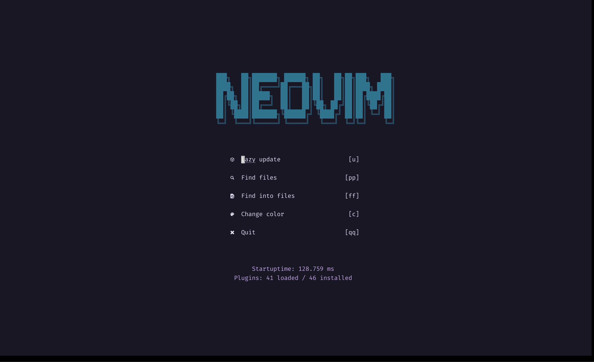
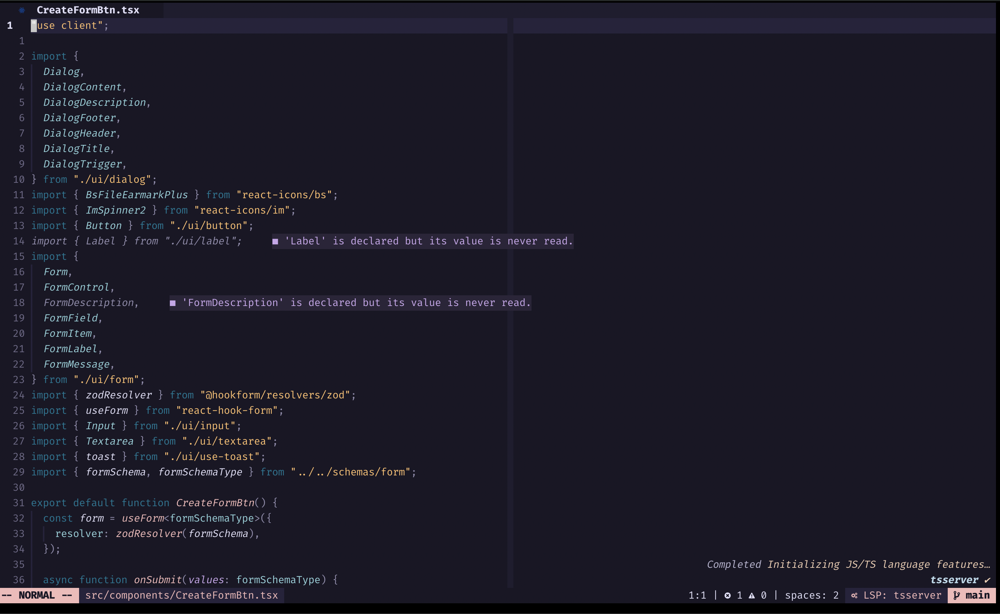
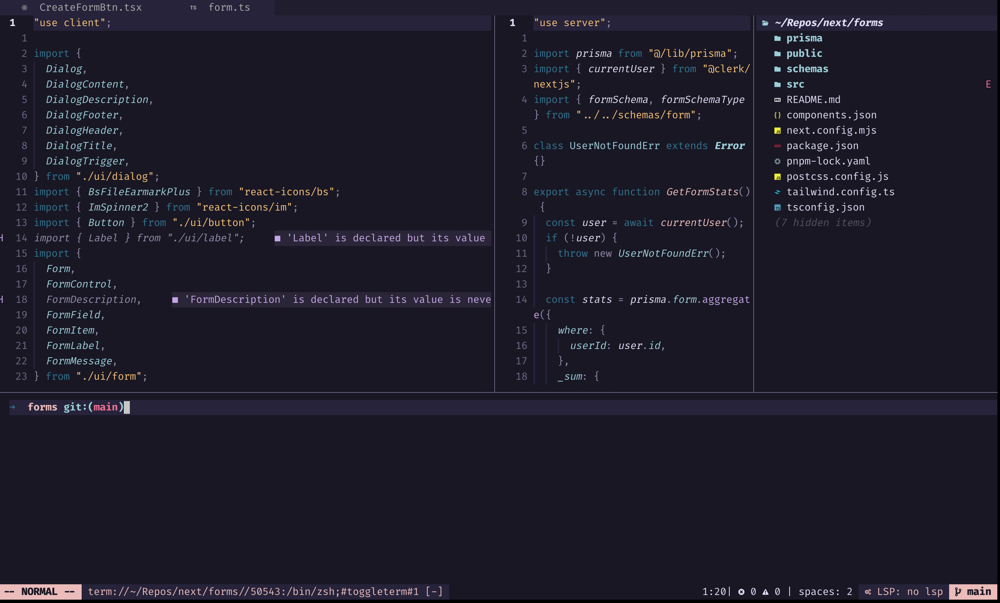
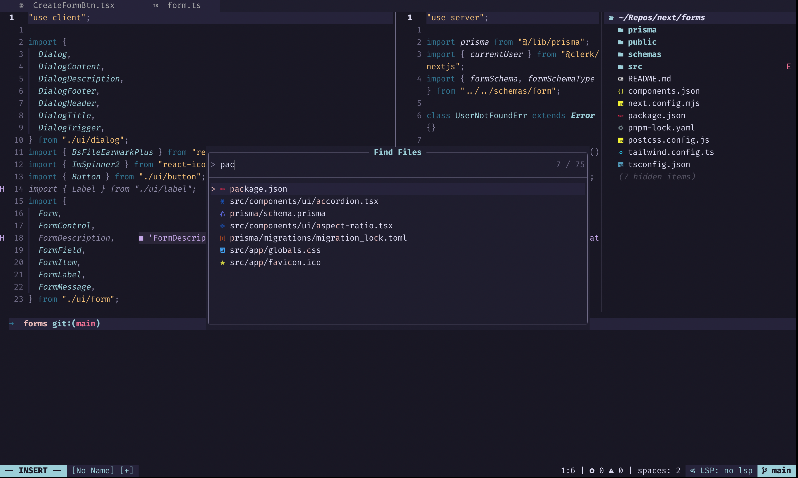
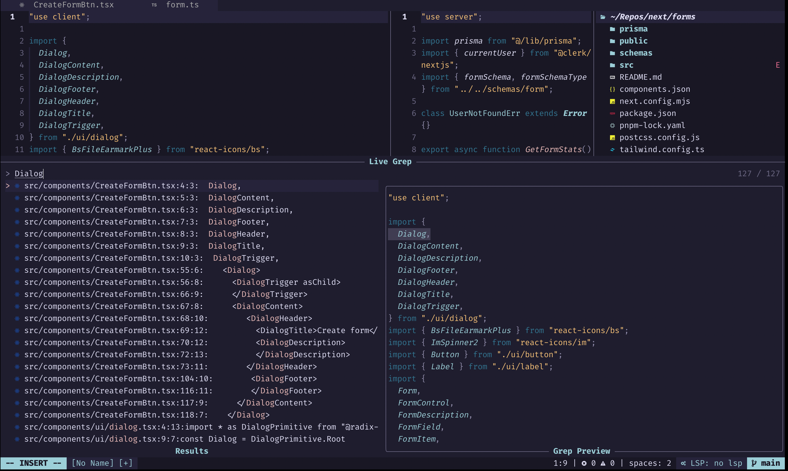
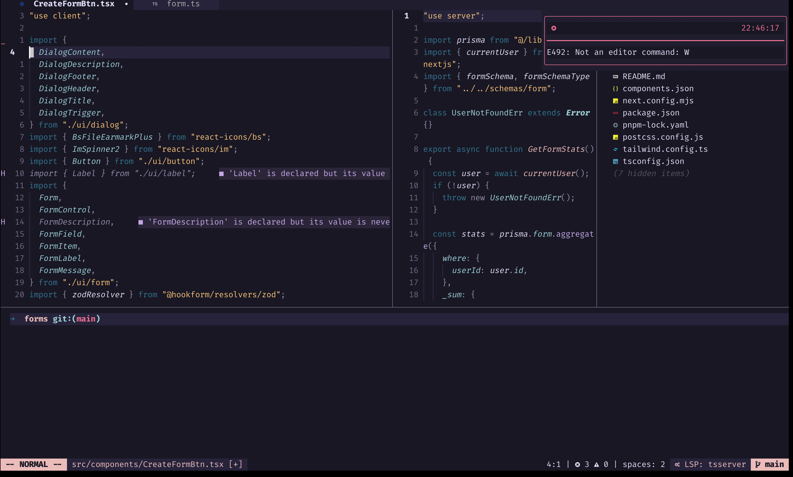
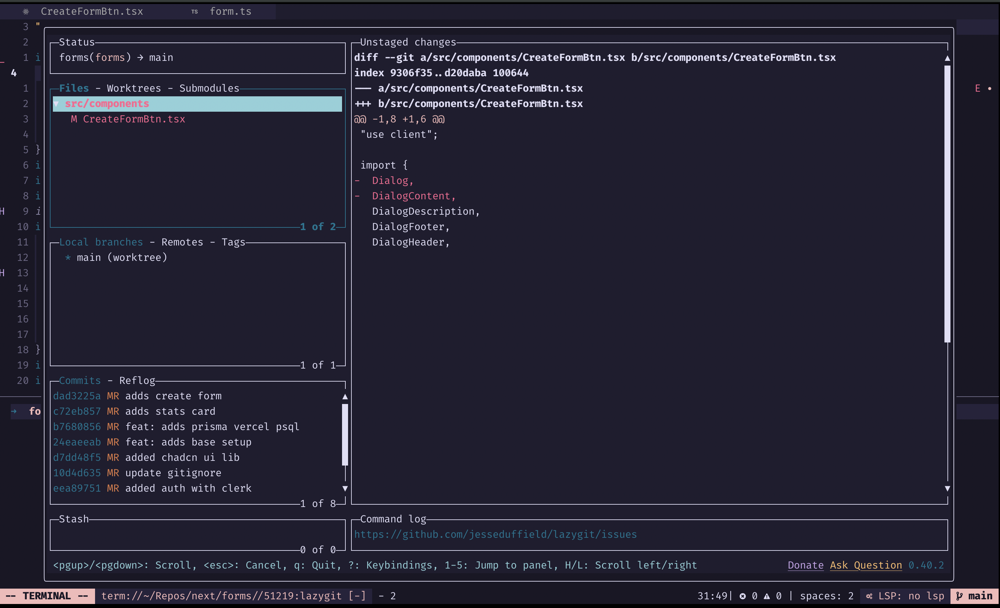

# Neovim

1. Dashboard

2. Status bar, lsp progress, syntax highlight

3. Tabs, split windows, file explorer

4. Find files

5. Find text in files

6. Notifications

7. Git manager

## Todo

- [ ] Add search in file - Is this even possible? -> `/` can do the trick
- [ ] Add a debugger for python and javascript at least
- [x] Personalize lualine in order to display LspInfo and see what it got attached to the buffer
- [x] Add highlight when copy
- [ ] Make the cmdline width absolute width and not relative width for buffer
- [x] Personalize init dashboard
- [ ] Add a restapi client
- [x] Add a markdown previewer
- [x] Add a notification plugin
- [ ] Add default languages for mason and treesitter
- [x] Behavior for neo-tree, when I Enter a file to automatically close neo-tree
- [x] Add support for copilot
- [x] Add treesitter selection, increase selection and decrease selection
- [x] Add surround plugin
- [x] Add support for closing buffers
- [ ] Add support for previous commands in cmdline
- [ ] Add support for multi cursor
- [x] Adds spell check - URGENT
- [ ] highlight wrong spell check instead of underline
- [ ] Adds space inside braces
- [ ] Remove highlight after a search -> `:noh`
- [ ] Personalize the floating of telescope. For instace in the find search I don't need a little preview next to the file name
- [ ] Adds case transformation - upper to lower and back
- [x] Go to dashboard when no buffers left
